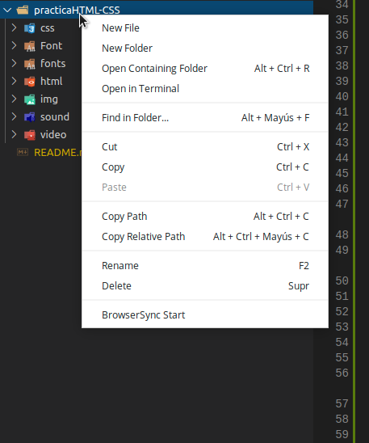

# practicaHTML-CSS

El reto consiste en crear una plataforma de contenido digital (solamente la
maqueta) utilizando HTML5 y CSS3, sin el uso de librerías externas, utilizando
una o más hojas de estili y que pueda visualizarse correctamente en los navegadores
principales más actuales: Google Chrome, Mozilla Firefox y Microsoft Edge.


## Estructura

Consta de tres páginas:

1. Una página de login, con un enlace a recordar la contraseña y los siguientes
   campos en el formulario:

   - Email, que servirá como nombre de usuario
   - Contraseña
   - Botón para enviar el formulario y hacer login

2. La pantalla principal de contenido con:

    - Un menú superior: logotipo de la plataforma, sección de novedades,
      series, películas o favoritos, formulario de búsqueda y opción para
      cerrar la sesión.
    - Una “rejilla” de películas o series de forma que en cada elemento se
      muestre una miniatura de la serie/película/episodio. Al situar el ratón
      encima, se mostrará sobre la miniatura información adicional: título,
      calificación, año de publicación y sinopsis resumida.
      
3. Una ficha detalle de la película/serie/episodio. Debe contener:

    - El mismo menú superior de la pantalla principal
    - Información básica de la película/serie/episodio: título, calificación,
      año de publicación, sinopsis completa y listado de actores.
    - Carátula o trailer. El trailer debe poder reproducirse en la propia
      página
    - “Rejilla” con contenido relacionado
    
## Detalles de implementación

- No se permite la interacción mediante javascript
- Uso de etiquetas de contenido semántico.
- Diseño sea responsivo.
- Las animaciones o interactividad deben realizarse exclusivamente
  mediante técnicas CSS sin el uso de librerías externas.
- No es necesario realizar múltiples páginas distintas para diferentes
  películas. Cualquier película, serie o episodio enlazará con la misma página
  de detalle.
- **Opcional**: Uso de atributos especiales de accesibilidad, microformatos...

## Puesta en marcha

Para visualizar la maqueta en la máquina de desarrollo es necesario disponer
de un servidor local especial para desarrollo. Se recomienda el uso de
[BrowserSync](https://www.browsersync.io) o de su
[extensión de VS Code](https://marketplace.visualstudio.com/items?itemName=jeremyrajan.browsersync)

Con VS Code:

1. Clonar el repositorio y abrir VS Code

```
$ git clone git@github.com:ChristianSalto/practicaHTML-CSS.git
$ cd practicaHTML
$ code .
```

2. Abrir el navegador local con la extensión BrowserSync haciendo click
   con el botón secundario sobre la carpeta `practicaHTML`:

   

3. La web será visible a partir de la URL http://localhost:3000/html/

Un ejemplo de ficha de detalle puede verse haciendo click en el enlace
_Play_ de la película de _El Joker_.